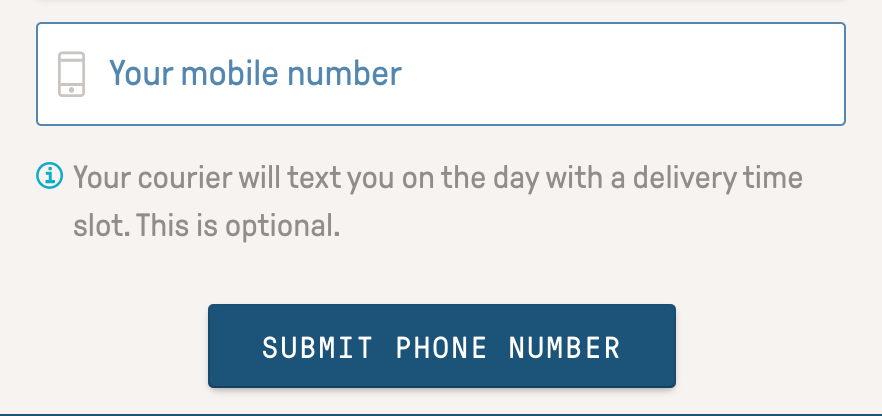
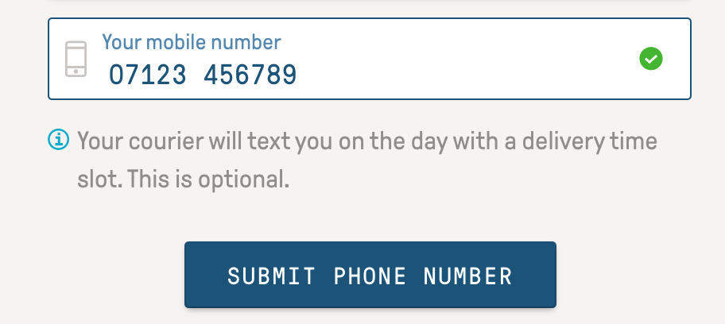
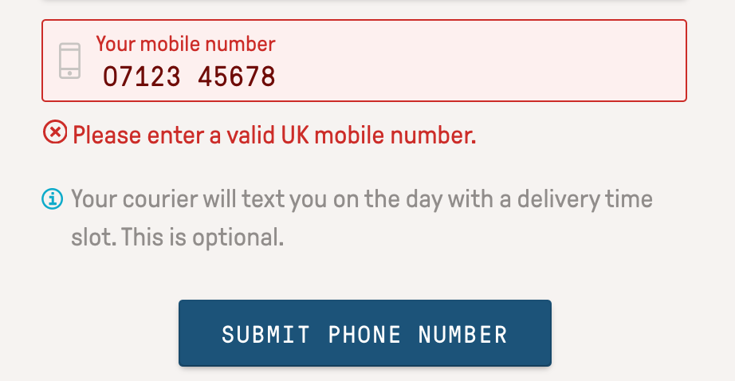

## Phone Number Task

## Introduction

We collect a customer's phone number on checkout so that we can send them SMS messages to remind them that their order is coming, and and other useful information about their delivery. We use Twilio to send the actual messages, and Twilio require the phone number to be formatted correctly before being sent to Twilio, including the +44 prefix.

On checkout, customers are able to input their phone number in any of the following formats:

- +447...
- 447...
- 07....

UK mobile phone numbers are **11 digits long** when in the 07... format (There are some exceptions, but you can ignore them), and always have a 7 after the prefix (whether it's +44, 44 or 0).

## Task

Your job is to build a simple frontend component that allows the user enter their phone number, and a submit button that submits the phone number to a Rails API for formatting and preparation for communication with Twilio.

- **The frontend component should support the following:**
    - A high fidelity design (See image below) - we are keen to see a design that matches that design exactly.
    - Error states and frontend validation & formatting.
        - I should be told if I input an incorrect number like 0634343
        - If I input 07123456789, it should be automatically formatted in realtime to 07123 456789
        - If I input +447123456789, it should be automatically formatted in realtime to +44 7123  456789
    - Upon submitting a valid form, it should fire off a request to the Rails API
    - This should all be done in React ideally, but we will consider Angular and Vue.js submissions as well.
- **The Rails API should support the following:**
    - Sensible REST routing patterns and sensible param definitions.
    - Built in validation (Don't assume our frontend has validated the phone numbers correctly. Return sensible error codes and messages if these fail).
    - Tests using RSpec or Minitest
    - You cannot use any libraries to aid the implementation or testing of this class outside of RSpec and the standard Rails libraries.
- Finally, we love clear code that is aided with comments and documentation - talk us through what you are doing and how you approached the problem - that helps us understand how you found the task.

We are conscious of your time so don't want you spending more than 2.5-3 hours on this project. If you reach that point in time without having completed the task, feel free to submit the task as is with an explainer of what you got done.

## Resources

### High Fidelity Designs

Note that all these designs are available in similar form on our live site if you follow through to checkout.

**Initial state:**

**Valid State:**

Note how the 'Your mobile number' moves to the top - this should be animated.

**Invalid State:**

### Icons

We've provided you the following icons within `app/assets/images`:

- Green checkmark

- Mobile icon

- Info icon

- Red cross

### Colours

We've included our brand and support colours in `app/assets/stylesheets/brand-colours.sass`

Blue (Primary): #1e5d84

Blue (Lighter Shade): #5d92b8

Pink: #f2c4c4

Red: #d2322e

Grey (Lighter i.e Background): #f7f5f3

Grey (Darker i.e Text): #9c9896

### Fonts

Button Title: GT Pressura Mono

Everything else: GT Pressura Regular

Fonts can be found in `app/assets/fonts` and `app/assets/stylesheets/fonts.sass`

### Getting started

Running your application should be as simple as:

1. Run `bundle`
2. Run `yarn`
3. Run `rails server`
4. You should find your application running on port 3000